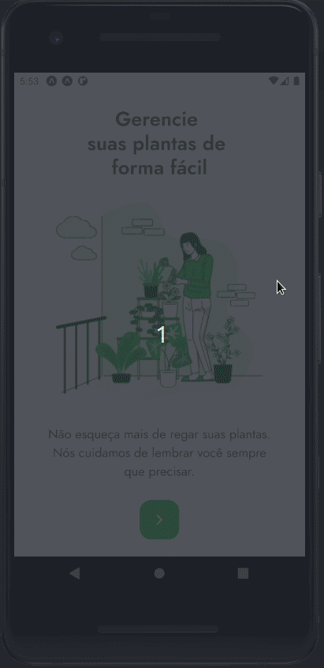
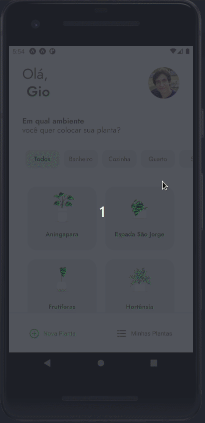
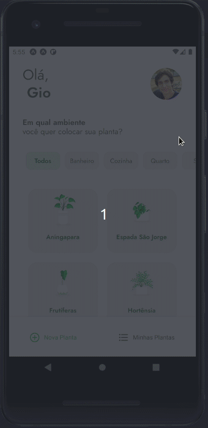
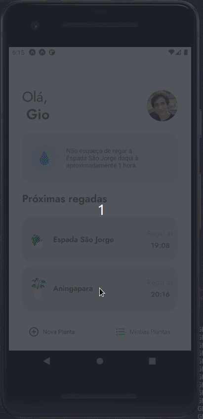
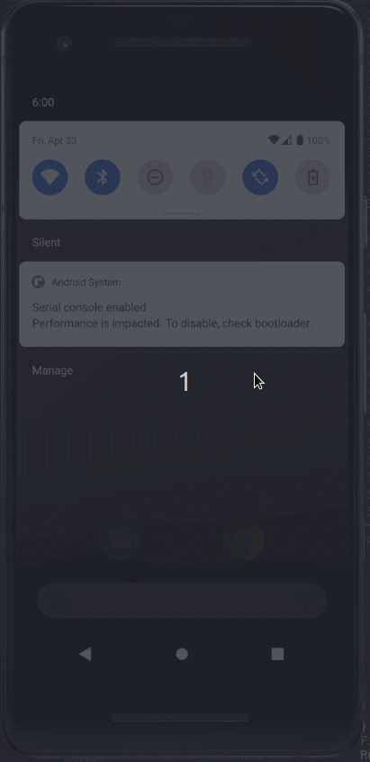
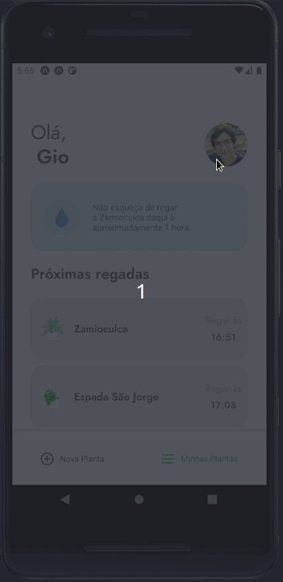

# PlantManager

<h1 align="center">
  
</h1>

<p align="center">PlantManager is an App created by Rocketseat to be the project
in the Next Level Week Edition #5 in the Trail React Native. The proposal of this project
is to remind you to water your registered plants in the App, so, following this way, we'll can
plant more and more! The tecnologies used are React Native and TypeScript.
</p>

<p align="center">
  <a href="https://github.com/Giovaniavs">
    
  </a>

  

  
</p>

---
<br>

- [Mockup](https://www.figma.com/file/IhQRtrOZdu3TrvkPYREzOy/PlantManager/duplicate?node-id=0%3A1)

<br>

---

## Table of Contents

<ul>
  <li><a href="#-getting-started">Getting Started</a></li>
  <li><a href="#-features">Features</a></li>
  <li><a href="#-support">Support</a></li>
</ul>

---

## 🌱 Getting Started

### Prerequisites

- Install Expo

```bash
npm install --global expo-cli
```

### Clone

- Clone this repo to your local machine using:

```
https://github.com/Giovaniavs/PlantManager
```

### Setup

- Install project dependencies;
  - ```javascript
    yarn install
    // or
    npm install
    ```
- Run project in development mode;

  - ```javascript
    expo start
    ```
- Be Happy! 😆

---

## 🌵 Features

<h2 align="center"> Register in the plataform </h2>
  <p align="center">
    
  </p>
<br>
<h2 align="center"> Filter the plants </h2>
  <p align="center">
    
  </p>
<br>
<h2 align="center"> Register your plants </h2>
  <p align="center">
    
  </p>
<br>
<h2 align="center"> Browse your plants </h2>
  <p align="center">
    
  </p>
<br>
<h2 align="center"> Notifications to remind you to water your plants! </h2>
  <p align="center">
    
  </p>
<br>
<h2 align="center"> Delete your plants registered </h2>
  <p align="center">
    
  </p>
<br>

### Build with

- [React Native](https://reactnative.dev/) - A JavaScript library for building user interfaces in a mobile environment.
- [Typescript](https://www.typescriptlang.org/) - TypeScript is an open-source language which builds on JavaScript, one of the world’s most used tools, by adding static type definitions.

---

## 🌿 Support

Reach out to me at one of the following places!

- Linkedin at [Giovani Albuquerque](https://www.linkedin.com/in/giovani-albuquerque/)
